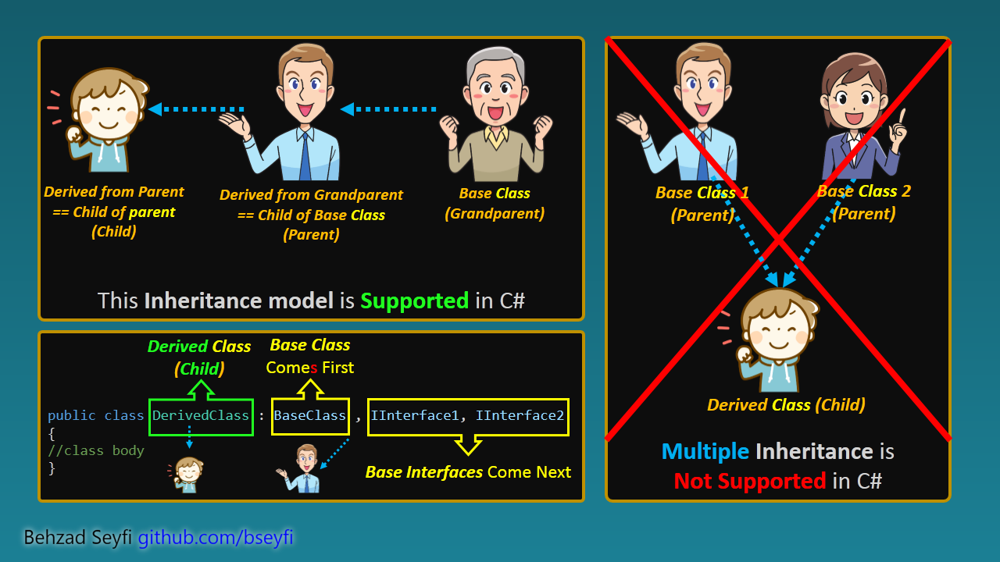

# C# Book - Chapter 6 : Inheritance
## Inheritance
### Inheritance Intro



*Inheritance* is a significant attribute of *Object-Oriented Programming*. A child type can reuse, extend or modify the parent type's behavior.

- **Classe**s and **interface**s **support** inheritances 
- Other type categories (**structs, delegates, and enums**) **do not support** inheritance.
- All types in the .NET implicitly inherit from `System.Object` (Or a type derived from it).

Any instance of a more-derived type *is a* derived and a base type. C# recognizes this relationship. This relationship is called *is-a* relationship.
All members of a child class are derived from its parent except the following members:
1.  *static Constructor*s
2.  *Instance Constructors*s
3.  *Finalizers*
Member access modifiers may prevent access to base class members in the derived class.

Classes in C# support only single inheritance, which means they can be inherited from one class directly.
A *class* or an *interface* can inherit from many interfaces directly.

### Inheritance and Conversions
**Upcast**: As a child *is a* parent or *grand*parent, we can *upcast* a type to its parent like this code:

```csharp
string str= new string("CS_Internship");
//upcasting implicitly
object obj = str;
```

**Downcast**: We can downcast a parent reference to a child reference in these ways:

1.  *Explicit Downcast*:

```csharp
var child = new Child();
//upcasting implicitly
Parent parentRefersToChild = child;

//explicit downcasting
var d = (Child)parentRefersToChild;

class Child : Parent { }
class Parent { }
```

Trying to *downcast* a `parentRefersToChild` instance to a `Child` type will throw an `InvalidCastException` if the `parentRefersToChild` not refers to `Child` or a type derived from `Child`.

2.  Down casting by use of `as` keyword: 

```csharp
var child = new Child();
//upcasting implicitly
Parent parentRefersToChild = child;

//explicit downcasting
var d = parentRefersToChild as Child;

class Child : Parent { }
class Parent { }
```

Using the `as` keyword is the same as *explicit down-cast* without the risk of exception; If the conversion fails, the `d` variable will get `null` without throwing any exception.

3. Check the type with the `is` keyword:

- You can check if a variable is of type of the `Child` or its parents type with the `is` keyword.
- `GetType()` method returns the exact type of the instance. You can see the similarity and differences between the two:

```csharp
var child = new Child();
//upcasting implicitly
Parent parentRefersToChild = child;

Console.WriteLine(parentRefersToChild is Child);      //✅prints True
Console.WriteLine(parentRefersToChild is Parent);     //✅prints True
Console.WriteLine(parentRefersToChild is GrandParent);//✅prints True

Console.WriteLine(parentRefersToChild.GetType() == typeof(Child));      //✅prints True
Console.WriteLine(parentRefersToChild.GetType() == typeof(Parent));     //⛔️prints False
Console.WriteLine(parentRefersToChild.GetType() == typeof(GrandParent));//⛔️prints False


class Child : Parent { }
class Parent : GrandParent { }
class GrandParent { }
```

### Interface Inheritance
A class or an interface can inherit from one or more interfaces. A class must implement all parent interfaces and all great-grandparents interfaces. 

```csharp
interface IBase1
{
  void Base1Method();
}

interface IBase2
{
  void Base2Method();
}
interface IBoth : IBase1, IBase2
{
  void BothMethod3();
}

//A class that implements an interface must also implement the interface's ancestors.
class ClassX : IBoth
{
  public void Base1Method() { }
  public void Base2Method() { }
  public void BothMethod3() { }
}
```

### Inheritance in Generics   
If you derive a **non-generic** type from a generic Type, you **must** provide the required type arguments.

If you derive a **generic** type from a generic Type, you **can** use type parameters in the parent.
  - It's **not possible** to derive from a type parameter directly.
  - It is **possible** to derive from a generic type with a mixed version of type parameters and type arguments(like `IBase<string, T>`)

```csharp
public class GenericBase1<T> { }
public class GenericBase2<TKey, TValue> { }
public class NonGenericDerived : GenericBase1<string> { }
public class GenericDerived<T> : GenericBase1<T> { }
public class MixedDerived<T> : GenericBase2<string, T> { }
```

### System.Object
`Object` is the default base class for any class defined without any base class. Even `struct`s are derived indirectly from `Object`. Almost any type is derived directly or indirectly from `Object`, but a few Types like pointers are not.

Interfaces are not derived from `Object`. However, a reference of an interface can be implicitly converted to a reference of type `Object`.

Reference to any kind of type has access to the following four methods:
- `Equals`: compares the identity of the current object with another one by default. Many classes override this method to do a value check instead.
- `GetHashCode`: returns an integer number that provides a reduced version of an instance members values. Keep in mind that every two instances which are equal **MUST** have identical hash codes.
- `GetType`: returns the run-time type of the instance
- `ToString`: provides a string representation of the type name by default or a customized string that can be based on the member variables.

Object **also**  defines the following `protected` methods:
- `Finalize`: is called just before the garbage collector removes the instance object. It is useful to do cleanup operations. 
- `MemberWiseClone`: Returns a shallow copy of the object.

### Virtual Methods
You can modify a `virtual` method( property, indexer, delegate, event declaration) in the derived type. If you assign a child instance object to a variable with the type of its parent, `override`d method will **not** call from the parent type(unlike redefining a new version of the same method in the child type).
If you redefine normal or virtual method (instead of overriding) in the inherited type, you hide the base class method in the inherited one. But if you convert an inherited instance object to the base type, that method will call the base class version.

overriding vs redefining a method:

```csharp
var chOver = new ChildOverrided();
var chRedef = new ChildRedefined();

chOver.M(); //prints: I'm Overrided Version
(chOver as Parent).M(); //prints: I'm Overrided Version

chRedef.M(); //prints: I'm Redefined Version
(chRedef as Parent).M(); //prints: I'm Parent Version

class ChildOverrided : Parent
{
  //overriding the base method
  public override void M()
  {
    Console.WriteLine("I'm Overrided Version");
  }
}

class ChildRedefined : Parent
{
  //redefine (newing or hiding) the base method
  new public void M()
  {
    Console.WriteLine("I'm Redefined Version");
  }
}

class Parent
{
  public virtual void M()
  {
    Console.WriteLine("I'm Parent Version");
  }
}
```

- As you see in the above example, the derived type has no obligation to `override` or redefine the `virtual` method of the base type.
- Unlike non-virtual methods, the decision to call a `virtual` method is made at runtime based on its actual type.
- `static` methods can **not** be `virtual`.

Another example of using `virtual` methods:

```csharp
using System;

var x = new Child();

x.M(); //prints: I'm Child Version
(x as Parent).M(); //prints: I'm Parent Version
(x as GrandPr).M(); //prints: I'm Parent Version
(x as ParentofGrandPr).M(); //prints: I'm ParentOfGrandPr Version
//(x as System.Object).M(); // generates compile-time Error because M is not a member of System.Object

class Child : Parent
{
  public virtual void M()
  {
    Console.WriteLine("I'm Child Version");
  }
}

class Parent : GrandPr
{
  public override void M()
  {
    Console.WriteLine("I'm Parent Version");
  }
}

class GrandPr : ParentofGrandPr
{
  public virtual void M()
  {
    Console.WriteLine("I'm GrandPr Version");
  }
}
class ParentofGrandPr : System.Object
{
  public virtual void M()
  {
    Console.WriteLine("I'm ParentOfGrandPr Version");
  }
}
```


---
***To be continued ...***

`#cs_internship` `#csharp` `#step4`
